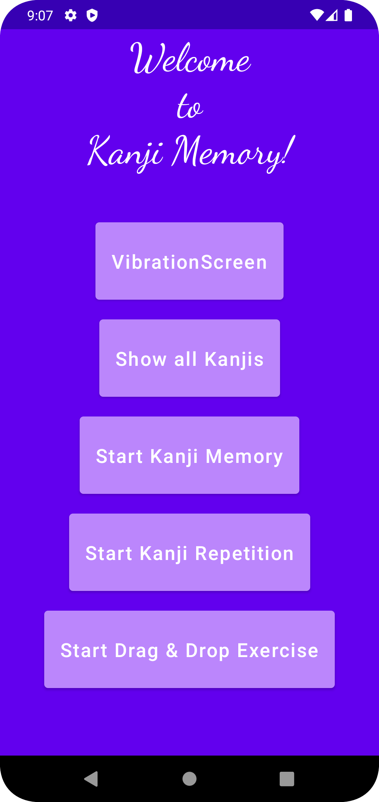
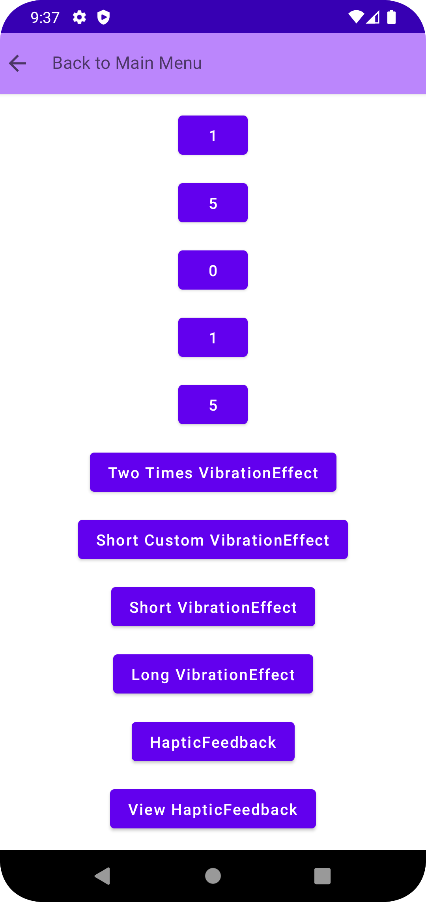
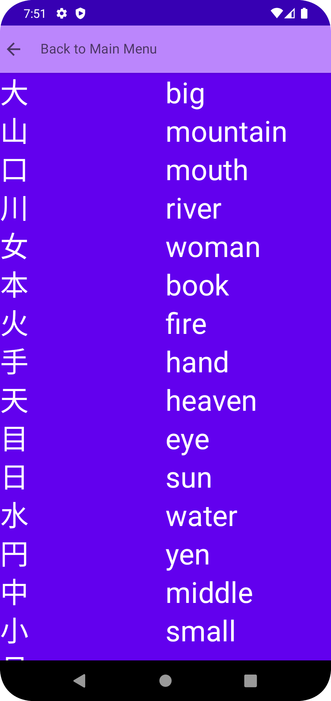
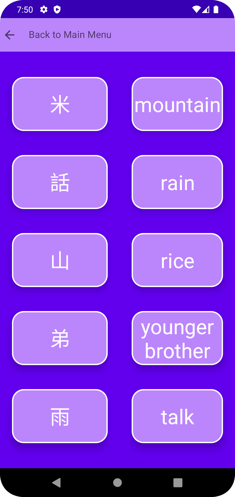
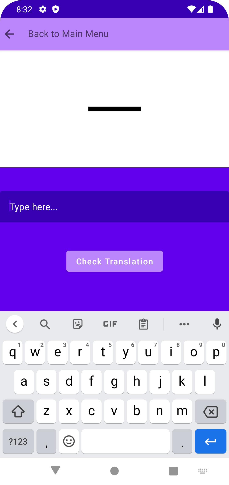
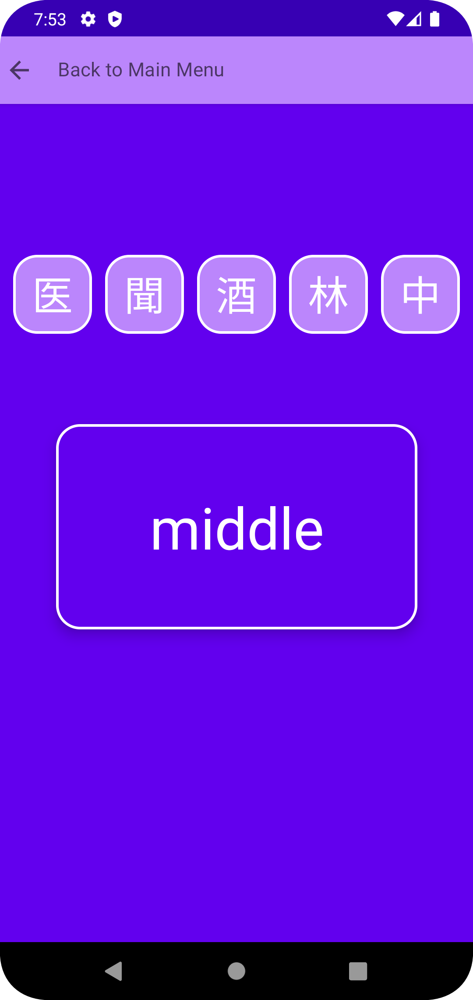

# Kanji Memory

This is my first app, fully written in Kotlin using Jetpack Compose for the UI and Room for the database. I followed the recommended architecture using MVVM and generally learned a lot creating this app.

It was designed to support learning 101 Japanese characters, i.e., Kanjis, in a fun and accessible way. 
Upon running the app, the home screen will show 5 buttons, which lead to the following (from top to bottom): 
- A screen of several buttons that vibrate. This was just added to try out different vibration patterns.
- A list of all 101 kanjis and their translations (only one translation was chosen for each kanji, although there may be more).
- A memory exercise, for which the task is to find the matching pairs between kanji and translation.
- A repetition exercise, where the correct translation needs to be typed into the textfield via the keyboard. It is designed as a spaced repetition system, though not fully formed yet (hardest exercise).
- A drag and drop exercise, where the correct kanji needs to be dragged into the translation (easiest exercise).

The following shows screenshots of the homescreen and the destinations of the buttons in chronological order: 

